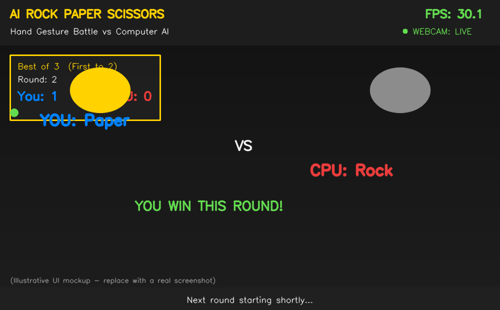

<p align="center">
  
</p>

<h1 align="center">AI Rock Paper Scissors Game (Using Hand Gestures)</h1>

<p align="center">
  A real-time computer vision game where you play Rock-Paper-Scissors against a computer AI opponent using nothing but your webcam and hand gestures — built with a clean, modular, production-grade software architecture.
</p>

<p align="center">
  
  
  
  
  
</p>

---

## 📌 Project Description

**AI Rock Paper Scissors** turns the classic hand game into a real-time human-vs-AI computer vision experience. Using your webcam, the system tracks your hand with **MediaPipe**, geometrically classifies your gesture as **Rock**, **Paper**, or **Scissors**, and pits it against a randomly generated computer move — automatically detecting the winner of each round and tracking the full match score.

Rather than a single-script demo, this project is engineered as a **modular Python package** with a clean separation between computer-vision detection, gesture classification, game rules, score presentation, and UI rendering. A full **timing-based game state machine** drives the experience: a main menu for choosing **Best-of-3** or **Best-of-5** match format, a **3-2-1 countdown** before each round, a brief **gesture capture window** with majority-vote resolution to eliminate misreads, a **reveal screen** showing both moves and the round result, and a **match-over screen** with the option to play again.

This project was built as part of an **AI & Machine Learning Diploma** portfolio to demonstrate applied computer vision engineering, real-time game-state design, and professional documentation practices suitable for GitHub, LinkedIn, and academic evaluation.

---

## ✨ Features

| Category | Capability |
|---|---|
| **Detection** | Real-time single-hand tracking via MediaPipe with 21-point landmark extraction |
| **Gesture AI** | Accurate Rock / Paper / Scissors classification using dual geometric heuristics |
| **Game AI** | Random, uniformly-distributed computer move generation each round |
| **Game Modes** | Selectable **Best of 3** and **Best of 5** match formats |
| **Automatic Judging** | Instant, rule-based winner detection per round (Rock > Scissors > Paper > Rock) |
| **Live Scoreboard** | Real-time player score, computer score, round counter, and match-format label |
| **Round History** | Compact win/loss/draw indicator strip showing match trajectory at a glance |
| **Countdown** | Animated 3-2-1-SHOOT countdown before every round |
| **Stabilization** | Sliding-window majority-vote smoothing for both the live preview and the final round-capture decision |
| **Performance** | Exponentially-smoothed, real-time FPS counter |
| **Confidence** | Live hand-detection confidence percentage with visual bar |
| **Reliability** | Webcam connectivity status indicator with automatic reconnect attempts |
| **Robustness** | Full exception handling — camera errors are caught and reported cleanly instead of crashing |
| **Fair Play** | A round with no clear gesture detected is automatically forfeited to the computer, preventing stalling |
| **Sound (optional)** | Lightweight, dependency-free beep sound effects on supported platforms |
| **UX** | Keyboard shortcuts: `3` / `5` to start a match, `R` to replay, `Q` / `ESC` to exit |
| **UI/UX** | Professional translucent overlay panels, rounded corners, icon-based move reveal, drop-shadow text |
| **Engineering** | Modular OOP architecture, PEP8-compliant, fully typed, docstring-documented, unit-testable game and gesture logic |

---

## 🛠️ Technology Stack

- **Language:** Python 3.12+
- **Computer Vision:** [OpenCV](https://opencv.org/) — video capture, image processing, real-time UI rendering
- **Hand Tracking Model:** [MediaPipe Hands](https://developers.google.com/mediapipe) — 21-point landmark detection
- **Numerical Computing:** [NumPy](https://numpy.org/) — array and image-buffer operations
- **Randomization:** Python's built-in `random` module — powers the computer AI's move selection
- **Architecture:** Modular, object-oriented, single-responsibility Python package

---

## 📥 Installation

### Prerequisites
- Python **3.12 or higher**
- A working webcam
- pip (Python package manager)

### Steps

```bash
# 1. Clone the repository
git clone https://github.com/abidcore/AI-Rock-Paper-Scissors.git
cd AI-Rock-Paper-Scissors

# 2. (Recommended) Create and activate a virtual environment
python -m venv venv

# Windows
venv\Scripts\activate

# macOS / Linux
source venv/bin/activate

# 3. Install dependencies
pip install -r requirements.txt
```

---

## ▶️ Usage

Run the application from the project root:

```bash
python main.py
```

### Keyboard Shortcuts

| Key | Action |
|---|---|
| `3` | Start a **Best of 3** match (from the main menu) |
| `5` | Start a **Best of 5** match (from the main menu) |
| `R` | Play again / return to menu (from the game-over screen) |
| `Q` or `ESC` | Exit the application at any time |

### How to Play
1. Launch the game and press `3` or `5` at the menu screen to pick your match format.
2. When the countdown reaches **"SHOOT!"**, show your Rock, Paper, or Scissors gesture clearly to the camera.
3. Hold the gesture steady during the brief capture window — the system samples several frames and takes the majority result for accuracy.
4. The reveal screen shows both moves and the round winner; the scoreboard updates automatically.
5. First to reach the required number of round wins (2 for Best of 3, 3 for Best of 5) wins the match.
6. Press `R` to play again, or `Q` / `ESC` to quit.

### Running in VS Code
1. Open the project folder in VS Code.
2. Select the interpreter from your `venv` (`Ctrl+Shift+P` → *Python: Select Interpreter*).
3. Run `main.py` directly, or use the integrated terminal: `python main.py`.

---

## 📁 Folder Structure

```
AI-Rock-Paper-Scissors/
│
├── main.py                     # Application entry point, state machine & orchestration
├── requirements.txt              # Python dependencies
├── README.md                      # Project documentation (this file)
├── LICENSE                         # MIT License
├── .gitignore                       # Git ignore rules
│
├── src/                              # Core application package
│   ├── __init__.py                   # Package exports
│   ├── hand_tracker.py               # MediaPipe Hands wrapper & landmark extraction
│   ├── gesture_detector.py           # Rock/Paper/Scissors classification + stabilization
│   ├── game_engine.py                # Pure game rules, scoring, match-completion logic
│   ├── scoreboard.py                 # Live scoreboard presentation layer
│   ├── fps.py                        # Smoothed FPS counter
│   └── utils.py                       # Drawing helpers, icon overlay, optional sound
│
├── config/                            # Centralized configuration
│   ├── __init__.py
│   └── settings.py                     # All tunable constants (camera, timing, colors, UI)
│
├── assets/                             # Visual assets
│   ├── logo.png
│   ├── demo.png
│   └── icons/
│       ├── rock.png
│       ├── paper.png
│       └── scissors.png
│
└── docs/                                # Extended documentation
    └── project_report.md                # Full academic-style project report
```

---

## 🎮 Game Rules

Rock Paper Scissors is played according to the classic universal rules:

- 🪨 **Rock** crushes ✂️ **Scissors**
- ✂️ **Scissors** cuts 📄 **Paper**
- 📄 **Paper** covers 🪨 **Rock**
- Identical moves result in a **Draw** (no score change)

**Match formats:**
- **Best of 3** — first player to win **2 rounds** wins the match.
- **Best of 5** — first player to win **3 rounds** wins the match.

**Special rule — No Gesture Detected:** If the system cannot confidently recognize a Rock, Paper, or Scissors shape during the capture window, that round is automatically awarded to the computer. This keeps the game fair and prevents indefinite stalling.

---

## 🖼️ Screenshots

<p align="center">
  
</p>

> The image above is an illustrative UI mockup generated to preview the layout. Replace `assets/demo.png` with an actual screenshot or GIF of the running application for your submission/portfolio.

---

## ✅ Advantages

- **Modular & maintainable** — hand tracking, gesture classification, game rules, and scoreboard presentation are fully decoupled and independently testable.
- **Fair, deterministic rules engine** — `game_engine.py` contains zero OpenCV/MediaPipe dependencies, making the win-condition logic trivial to unit test.
- **Flicker-free gesture recognition** — a two-tier smoothing strategy (continuous live-preview stabilizer + independent round-capture majority vote) produces reliable results.
- **Orientation-independent thumb logic** — reuses a scale-invariant distance heuristic rather than fragile left/right-hand branching.
- **Fails gracefully** — camera disconnection and unexpected exceptions are caught and reported, never crash the game.
- **Configurable** — every threshold, color, timing value, and dimension lives in one settings file.
- **Portfolio-ready** — clean PEP8 code, full docstrings, and academic-grade documentation.

---

## 🚀 Future Scope

- Add a **best-of-N custom mode** where the player can type any odd number of rounds.
- Introduce a **difficulty-adaptive AI** that learns from the player's move history instead of choosing purely at random.
- Add a **two-player mode** using two hands/cameras for local multiplayer.
- Integrate **richer audio** (a proper sound-effects library) for countdown ticks, win/lose stings, and background music.
- Add a **match history log** exported to CSV/JSON for post-game analysis.
- Build a **web-based version** using a browser-accessible video pipeline (e.g. via a Flask/Streamlit front end).
- Add an automated **pytest suite** with CI integration covering `game_engine.py` and `gesture_detector.py`.

---

## 📄 License

This project is licensed under the **MIT License** — see the [LICENSE](LICENSE) file for details.

---

## 👤 Author

**Abid Ali**
AI & Machine Learning Diploma Student

- GitHub: [github.com/abidcore](https://github.com/abidcore)
- LinkedIn: [linkedin.com/in/abid-ali-shaikh-03a591423](https://www.linkedin.com/in/abid-ali-shaikh-03a591423)
- Email: [abidalishaikh2007@gmail.com](mailto:abidalishaikh2007@gmail.com)

---

<p align="center">⭐ If you found this project useful, consider giving it a star on GitHub!</p>
